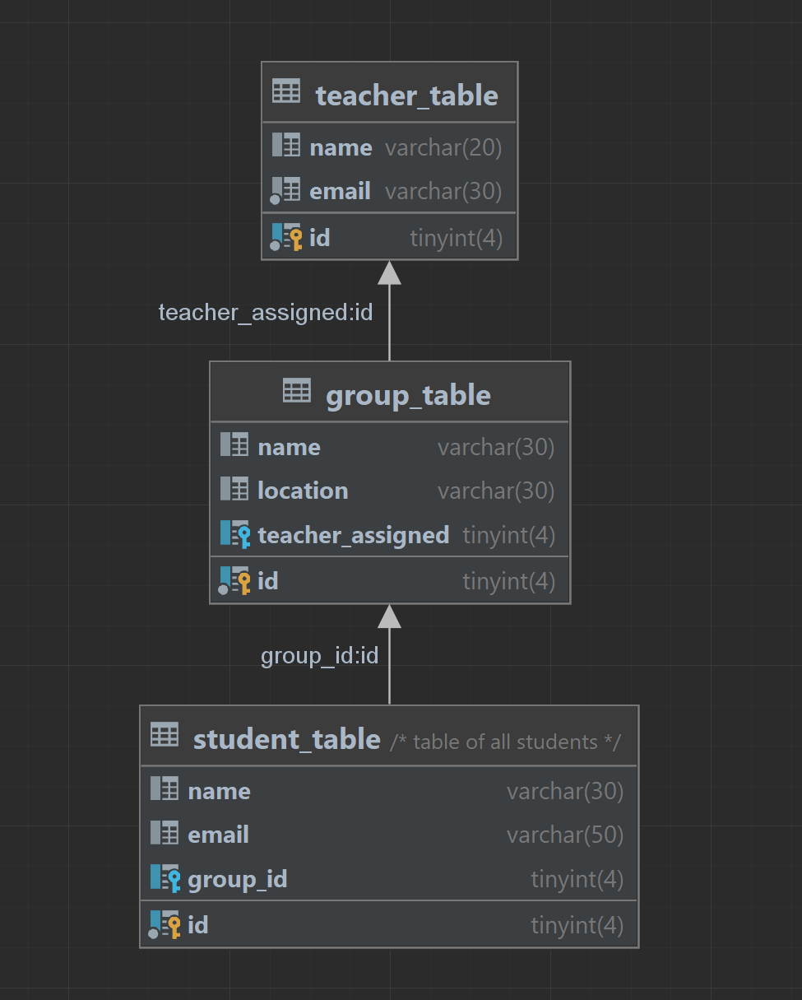
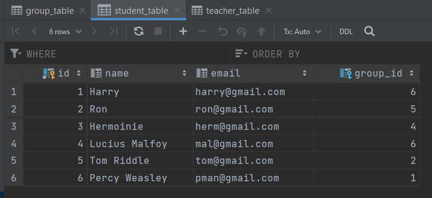
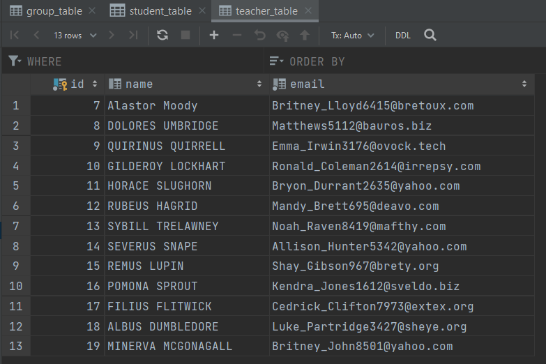
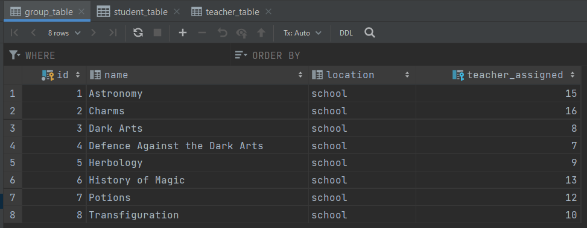

# You are a Wizard, Harry!

## Welcome to Hogwarts

### Day One Stand-up Meeting Goals:

- [x] Re-read the assignment together.
- [x] Sort GitHub : Create new personal branches & make sure local and remote branches are linked.
- [x] Set up a DB and tables with dummy data so we can all import the exact same file into our DB managers.
- [x] Set up MVC skeleton and plan out Folder architecture.
- [x] Work out environment variables configuration.

### Day Two Stand-up Meeting Goals:

- [x] Sort Connection to DB.
- [x] Add Controllers for: each Students, Teachers and Groups.
- [x] Add Models for: each Student, Teacher and Group.
- [x] Add Loader Models for: Students, Teachers and Groups.
- [x] Add Views for: Students, Teachers and Groups.
- [x] Get the index.php to correctly manage and assign a Controller based on $\_GET.
- [x] Do some queries and print them in their respective View!

### Day Three Stand-up Meeting Goals:

- [ ] Have the index display a table for each entity.
- [ ] Work on more specific queries to pass on to the respective view.
- [ ] Take the iterable arrays from the controllers and pass them to the views so they can accordingly present the data as tables.

### Problems encountered
- Difficulty keeping the same pace in learning & coding
- Confusion with MVC as it was our first times working with it
- DB setup - initially had far too many foreign_keys that were conflicting with each other
- TOO.MANY.FILES.exe
- files apearing after a merge without explaination
- a multitude of concepts to learn at once, without seening a real-world example for reference
- not enough time to absorb information while also trying to rush ahead & complete the project
- communication could be improved (but, project was short)

### Reflection
- Start with a trello board :) (short-term, acheivable goals)
- Make sure everyone can understand the smallest of steps before moving forward as a team (this is meant to be a learning exercise)
- More structured "meets" where everyone has their turn to talk without distraction
- Much of the learning objectives were met, but not in enough detail & not independently enough to make everything stick
- Exercise could have been split into more managable sections to make it less overwhelming
